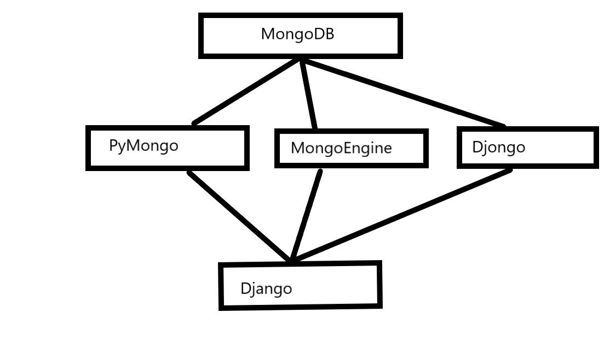

---

author:
  name: Linode Community
  
  email: docs@linode.com

description: 'A guide describing how to intigrate MongoDB to Django.'

keywords: []

license: '[CC BY-ND 4.0](https://creativecommons.org/licenses/by-nd/4.0)'

published: 

modified_by:

  name: Linode
title: 'How to Intigrate MongoDB to Django '

contributor:
  name: Shreyas Kumar
  link: '[Linkedin](https://www.linkedin.com/in/shreyas-kumar-3211851b7)'

external_resources:

  - '[How to instal MongoDB](https://www.linode.com/docs/guides/install-mongodb-on-ubuntu-16-04/)'

  - '[How to install Django](https://www.djangoproject.com/download/)'
---
<!-- Introduction to MongoDB and Django. -->

## What is Mongodb?

MongoDB is a document database, i.e, stores data in a JSON format rather than following row/column format. MongoDB comes into the picture when one needs to store unstructured data efficiently, also to access the data, NoSQL is preferred.

## What is django?

Django is a Python-based web framework that follows the MVT(Model-View-Template) architectural pattern. It is free and open-source, It is engineered in such a way that hassle during development and devs can write their applications without any security mistakes, also,  Django has the ability of scaling exceedingly.

## Ways to intigrating MongoDB to Django

There are three ways to connect MongoDB to Django, 

### PyMongo
The most common and offlicial way of intigrating Django with MongoDB is using `PyMongo`,it provides the database functionalities like search, update, insert, delete, one can get it via pip.  Assuming that you have a Django app of your own in which you have to connect MongoDB Database, the installation process is given below
To install PyMongo, use the following command

    $ python -m pip install pymongo

After installation of PyMongo, install `dnspython` using the command

    $ python -m pip install dnspython

#### Creating a simple PyMongo seassion
1. Creat a utils file that can be used as a view that needs to interact with the database, to do that, create a `utils.py` file in the same directory where `manage.py` is there, to instantiate the clint, use the following code
<pre><code>
from pymongo import MongoClient
def get_db_handle(db_name, host, port, username, password):
client = MongoClient(host=host,
                      port=int(port),
                      username=username,
                      password=password
                     )
db_handle = client['db_name']
return db_handle, client
</code></pre>

2. One can also make use of `connection_string`, to do that, use the following code 
<pre><code>
from pymongo import MongoClient
client = pymongo.MongoClient('connection_string')
db = client['db_name']
</code></pre>
Where connection_string is
 <pre><code>
 connection_string = mongodb+srv://<username>:<password>@<atlas cluster>/<myFirstDatabase>?retryWrites=true&w=majority
 </code></pre>

---
**NOTE**

If you are on a default port and host, calling  MongoClient('localhost',portnumber) will work.

---
## MongoEngine

It is an ORM layer on top of PyMongo, a lot of devs may find the features of PyMongo quite sufficient, to handle unstructured JSON data, it gives feild like DictFeild and ListFeild.

Install MongoEngine using the following command

<pre><code>$ python -m pip install pymongo </code></pre>

And in `settings.py`use the following code
<code><pre>
import mongoengine
mongoengine.connect(db=db_name, host=hostname, username=username, password=pwd)
</code></pre>
One also needs to define a schema in the models.py file as MongoEngene is schemaless.

## Djongo

It is an improvised way of PyMongo, using Djongo, the need of writing lengthy code is eleminated. It follows ODM(Object Document  Architecture), i.e, maps Python objects with MongoDB Documents.
For installation 
<pre><code>$ python -m pip install djongo</code></pre>
Now open `settings.py` folder and in `DATABASES` and change the settings to point to MongoDB
<pre><code>DATABASES = {
       'default': {
           'ENGINE': 'djongo',
           'NAME': 'db-name',
       }
   }</code></pre>

---
**NOTE**

If your database is secured then fill the Client information like USERNAME and PASSWORD .

---
<pre><code>DATABASES = {
        'default': {
            'ENGINE': 'djongo',
            'NAME': 'your-db-name',
            'ENFORCE_SCHEMA': False,
            'CLIENT': {
                'host': 'mongodb+srv://<username>:<password>@<atlas cluster>/<myFirstDatabase>?retryWrites=true&w=majority'
            }  
        }
}</code></pre>
Befor making migrations, make sure your app name is in the list of installed apps.